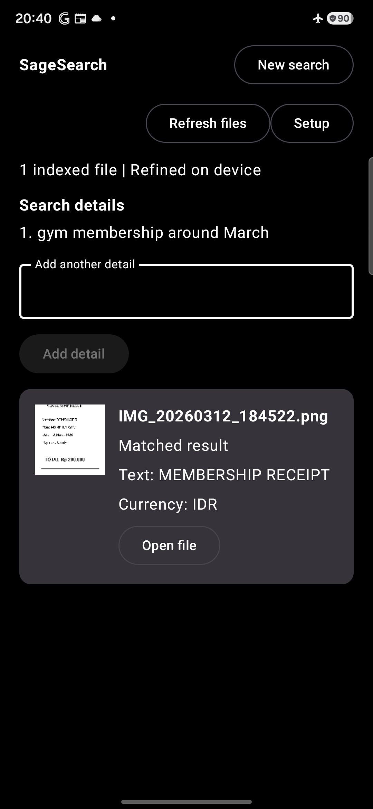

# SageSearch — AI File Finder

[](LICENSE)

> Find local files using plain language. Your file index and results stay on your device.

---

## Arm Create hackathon build: Android offline search

The current hackathon build turns SageSearch into an offline Android file-search
launcher for **Track 3: Mobile AI**. A user approves files or folders, SageSearch
indexes their metadata and bounded OCR locally, and an on-device Gemma 4 E2B
planner converts remembered details into a strictly validated search plan.

Gemma never sees filenames, OCR text, database rows, file URIs, or search
results. Trusted Kotlin code validates the plan and queries a private Room/FTS
index. Deterministic preliminary results stay available while the model runs or
if inference fails.

### The demo difference

The same phrase, `gym membership around March`, was tested in airplane mode on
a Samsung Galaxy A57. Samsung My Files 15.4.09.5 returned no result. SageSearch
matched the camera-named synthetic receipt `IMG_20260312_184522.png`, showed
stored match evidence, and opened the original.

| Native filename search | SageSearch local intent search |
|---|---|
|  |  |

The controlled comparison uses one device and one synthetic fixture. It is not
a universal claim about every Android file manager or private document corpus.

### What changed for Arm

Before the challenge, SageSearch was a Windows/LM Studio proof of concept and
the Android folder contained a single-image OCR prototype. The challenge-period
contribution is the complete offline Android search system and Arm evidence in
this section:

- Replaced desktop LM Studio dependency with reusable on-device LiteRT-LM 0.16.0
  inference on an `arm64-v8a` phone.
- Reduced Gemma's job to a compact constrained query-planning contract instead
  of RAG over private documents.
- Added native JSON-schema-constrained decoding, strict validation,
  deterministic reconciliation, and exact-first local ranking.
- Serialized expensive OCR and inference work while giving interactive search
  priority.
- Added resumable WorkManager indexing, bounded image/PDF OCR, Room FTS4, and a
  200-candidate retrieval cap.
- Measured backend, prompt, output-control, quality, latency, memory, battery,
  and thermal behavior on the target Arm device.

### Measured A57 evidence

Model: Gemma 4 E2B LiteRT-LM container, 2,588,147,712 bytes, SHA-256
`181938105e0eefd105961417e8da75903eacda102c4fce9ce90f50b97139a63c`.
The matrix uses 20 public synthetic planner cases.

| Configuration | Schema valid | Plan F1 | Median | p95 | Result |
|---|---:|---:|---:|---:|---|
| GPU baseline, unconstrained | 0% | 0.000 | unavailable | unavailable | 20/20 generation calls failed with `LiteRtLmJniException` |
| CPU baseline, unconstrained | 0% | 0.000 | 8.009 s | 12.810 s | Failed quality gate |
| CPU optimized, unconstrained | 100% | 0.636 | 4.617 s | 8.463 s | Failed quality gate |
| CPU optimized, constrained hybrid | 100% | 1.000 | 8.766 s | 11.820 s | Production default |

GPU generation did not produce a comparable passing baseline, so GPU speedup is
**not measurable** and this project makes no GPU, NPU, SME2, i8mm, KleidiAI,
battery-life, or energy-efficiency claim.

The separate on-device Room/FTS smoke benchmark seeded 10,000 synthetic
documents. After three warmups, 25 recorded runs measured **8.971 ms p50** and
**12.069 ms p95**, with the intended document ranked first for all three fixed
queries. This timing excludes OCR, Gemma inference, and UI rendering.

Raw and summarized evidence:

- [42-second captioned demo draft](artifacts/demo/SageSearch-Arm-Create-demo-draft.mp4)
- [`results/task11/a57/summary/comparison.md`](results/task11/a57/summary/comparison.md)
- [`results/task11/a57/summary/comparison.json`](results/task11/a57/summary/comparison.json)
- [`results/task11/a57/demo-rehearsal.json`](results/task11/a57/demo-rehearsal.json)
- [`benchmark/search-planner/README.md`](benchmark/search-planner/README.md)

### Fast judge path

Requirements: an Arm64 Android device running Android 7.0/API 24 or newer, a
compatible Gemma 4 E2B `.litertlm` file obtained separately, and USB debugging
for APK installation.

1. Build or install `android/app/build/outputs/apk/debug/app-debug.apk`.
2. Launch SageSearch and approve a folder or individual files through Android's
   system picker.
3. Choose the compatible `.litertlm` model under **Prepare AI model**. The app
   copies it to backup-excluded private storage, calculates its hash, and only
   shows **Ready** after LiteRT-LM initialization succeeds.
4. Wait for local indexing to finish, then tap **Search indexed files**.
5. Turn on airplane mode and search `gym membership around March` against
   [`artifacts/demo/IMG_20260312_184522.png`](artifacts/demo/IMG_20260312_184522.png).
6. Inspect the factual match fields, tap **Open file**, add another remembered
   detail to strengthen the same search, then tap **New search** to reset.

### Build and verify

Use Android Studio's JDK 17 and Android SDK 36:

```powershell
cd android
.\gradlew.bat testDebugUnitTest lintDebug assembleDebug assembleDebugAndroidTest
```

Install on an authorized device:

```powershell
adb install -r app/build/outputs/apk/debug/app-debug.apk
```

Regenerate the checked-in comparison after capturing the fixed matrix:

```powershell
python benchmark/search-planner/build_task11_report.py `
  --cases benchmark/search-planner/cases.jsonl `
  --result-root results/task11/a57/matrix `
  --retrieval results/task11/a57/preliminary-search.json `
  --output-dir results/task11/a57/summary
```

Final local verification: 74 Android JVM tests, 9 Python evaluator/report tests,
19 Windows-backend tests, 3 cloud-proxy tests, dependency audits with zero known
vulnerabilities, Android lint, debug assembly, APK install, and the A57
10,000-document instrumented benchmark. Debug APK SHA-256:
`02B5E99E79BDC359F8DE94B8B7DB4BEBBBE9B97ACB9EA79238900EEFE3AE3068`.

### Known limitations

- The APK does not bundle or redistribute the 2.6 GB Gemma model; the user must
  obtain and select a compatible container separately.
- Planner evaluation uses a 20-case synthetic smoke set, not broad production
  accuracy testing.
- End-to-end planning takes several seconds on the tested A57; fast local
  preliminary retrieval keeps the search experience usable during refinement.
- Only the Samsung Galaxy A57 configuration is claimed. No A05, GPU-speedup,
  energy, or battery-life result is presented.
- Android Storage Access Framework restrictions mean users must explicitly
  approve accessible folders or individual files.

The source code is licensed under [Apache License 2.0](LICENSE). Third-party
models and dependencies remain under their own licenses and terms. The Gemma
model file is not included in this repository.

---

## Windows proof of concept

### Quick Start (No Terminal Needed)

1. Choose `provider.mode` in `backend/config.json`: `local` for LM Studio or `cloud` after deploying the Cloud Run proxy.
2. For local mode, enable LM Studio's local server: **Developer tab → Enable Local Server**
3. Double-click **`Start SageSearch.bat`**
4. Your browser opens automatically at `http://localhost:3001`

That's it. 🎉

---

## What You Can Say

| Example prompt | What happens |
|----------------|-------------|
| *"Find all PDFs from last week"* | Searches all folders for recent PDFs |
| *"Show me videos in Downloads"* | Filters by folder + file type |
| *"Find screenshots from yesterday"* | Date-filtered image search |
| *"Audio files named recording"* | Keyword + type combined |
| *"Excel files from this month"* | Document type + date range |
| *"Show presentations in SSD HP"* | PowerPoint-compatible file formats in that location |
| *"Find receipts containing coffee"* | Searches text recognized locally inside receipt images |
| *"Receipts from Toko ABC"* | Searches analyzed receipt text and receipt candidates |

---

## How It Works

```
Your prompt
    │
    ▼
SageSearch Backend (localhost:3001)
    │  calls ▼
LM Studio (localhost:1234)  ← Gemma 4 E4B, runs on your machine
    │  tool call ▼
local SQLite index           ← scans locations in the background
    │  returns metadata ▼
AI writes a summary
    │
    ▼
File cards appear — click "Show in Explorer"
```

**Your file index, image analysis, and results stay on your device by default.**
When local image analysis is enabled, SageSearch reads supported image pixels
with Windows OCR and stores derived OCR text and receipt candidates in the local
SQLite index. It does not modify the original image. In cloud query mode, only
the typed search phrase, current date, and a fixed search vocabulary are sent
for interpretation. File names, paths, image pixels, OCR text, metadata, and
results remain local. Optional cloud image analysis is not implemented yet.

---

## Search Locations

| Folder | Path |
|--------|------|
| Documents | `C:\Users\<you>\Documents` |
| Downloads | `C:\Users\<you>\Downloads` |
| Desktop   | `C:\Users\<you>\Desktop`   |
| Pictures  | `C:\Users\<you>\Pictures`  |
| Videos    | `C:\Users\<you>\Videos`    |
| Music     | `C:\Users\<you>\Music`     |

SageSearch indexes these default locations on first launch. Use the **+** beside
Search Locations to add any folder or a removable-drive root (for example `E:\`).
Each location shows whether it is indexing, ready, or disconnected. You can
refresh or remove a location from the sidebar.

Searches read the local SQLite index rather than walking folders at query time.
If a removable drive is unplugged, its previous results stay visible and are
marked **Unavailable** until the drive reconnects.

---

## File Types Supported

| Category | Extensions |
|----------|-----------|
| Document | .pdf .docx .xlsx .pptx .txt .csv .md … |
| Image    | .jpg .png .gif .bmp .webp .heic … |
| Video    | .mp4 .mkv .avi .mov .wmv .webm … |
| Audio    | .mp3 .wav .flac .aac .ogg .m4a … |

---

Initial local OCR supports JPG/JPEG, PNG, BMP, and TIFF images. Other image
formats remain searchable by metadata but are marked as unsupported for OCR.

## Test Receipt Search

1. Put a clear JPG or PNG receipt in an indexed folder such as Pictures or
   Downloads.
2. Start SageSearch and wait for the **Analyzing image text locally** notice, or
   find the image by filename and click its sparkle button to move it to the
   front of the analysis queue.
3. Search for visible text, for example `Find receipts containing coffee` or
   `Receipts from Toko ABC`.
4. Matching cards show the OCR snippet, receipt badge, and extracted candidates
   such as total, currency, or date when detected.

Windows OCR uses recognition languages installed with Windows. If results use
the wrong language, install the corresponding Windows language pack and retry
the failed analysis or reindex the location.

`imageAnalysis.pipelineVersion` identifies the derived OCR/receipt format. Bump
it when the processor or receipt rules change incompatibly; SageSearch preserves
the original images, clears only stale derived analysis, and queues them again.

---

## Test the Android Hackathon Build

The current Android app is in `android/`. It uses Android's Storage Access
Framework for persistent user-approved access, bounded bundled ML Kit OCR,
Room/FTS retrieval, and an optional on-device Gemma 4 E2B planner through
LiteRT-LM. It requests neither Internet nor broad external-storage permission.

Open `android/` in Android Studio, let Gradle sync, and run the `app`
configuration on an Android 7.0 (API 24) or newer device. Detailed setup and
current scope are in `android/README.md`.

For a short Windows/Android feedback session, follow
`docs/IMAGE_SEARCH_TEST_CHECKLIST.md`.

---

## Interpret Search Providers

Every provider receives a search phrase, today's date, and a fixed vocabulary.
It returns only validated filters: file type, file-format extensions, filename keywords, location label,
created/modified date range, unsupported clues, and at most one clarifying
question. The backend then runs the SQLite search itself. Providers never
receive file names, paths, index rows, result counts, or document content.

`backend/config.json` selects the provider:

```json
{
  "provider": {
    "mode": "cloud",
    "local": {
      "endpoint": "http://localhost:1234",
      "model": null
    },
    "cloud": {
      "proxyUrl": "https://YOUR-CLOUD-RUN-URL/interpret"
    }
  }
}
```

- `local` uses the configured LM Studio OpenAI-compatible endpoint. Nothing is sent off-device.
- `cloud` posts to the SageSearch Cloud Run proxy, which can call DeepSeek with its server-side credential. Only the typed search phrase leaves the app; local metadata and results remain local.

Cloud mode requires a deployed proxy URL in `backend/config.json`. The proxy
holds its provider credential in Secret Manager and applies request validation
plus a conservative rate limit. Do not commit provider credentials or an
active shared demo endpoint to a public repository.

Deploy the service in `cloud-proxy/` using its README. The DeepSeek key is a
Cloud Run Secret Manager value, never desktop-app configuration or source code.

## Configuration

Edit `backend/config.json` to change the LM Studio port if needed:

```json
{
  "lmStudio": {
    "host": "localhost",
    "port": 1234
  }
}
```

The development index is stored locally at `backend/data/sagesearch.sqlite`. It
contains file metadata and, when image analysis is enabled, derived OCR text,
receipt candidates, analysis state, and retry jobs. It does not store a second
copy of the original image. Electron should launch the backend with `SAGESEARCH_DATA_DIR`
set to Electron's per-user `app.getPath('userData')`, so installed updates never
overwrite the user's index. Delete the database file to rebuild the index from scratch.

## Built with Codex and GPT-5.6

SageSearch was developed with Codex, powered by GPT-5.6, as a product and
engineering thought partner. Codex helped challenge the original local-model
prototype, define a consumer-first Windows experience, and turn those decisions
into a focused architecture.

Together, we designed **SageSearch Cloud** around one clear boundary: AI
understands the user's typed request and returns structured search filters,
while SQLite searches the local file index. SageSearch Cloud receives only the
search phrase; file names, folder paths, metadata, document contents, and
search results remain on the user's computer.

Key decisions Codex and GPT-5.6 helped shape:

- Separate AI query interpretation from fast local file retrieval.
- Keep private file data on-device, even when cloud interpretation is enabled.
- Search immediately with supported clues and ask one targeted clarification
  for vague, empty, overly broad, or unsupported requests.
- Prioritize a Windows-first consumer experience while deferring broader scope
  such as macOS, document-content search, and email search.

Supporting documents:

- [Principles and architecture](https://github.com/gitnyaDanil/SageSearch/blob/main/docs/PRINCIPLES_AND_ARCHITECTURE.md)
- [Codex feedback and demo narration](https://github.com/gitnyaDanil/SageSearch/blob/main/docs/CODEX_FEEDBACK.md)

---

## Principles

1. 🔒 **Privacy First** — File contents and metadata stay local; cloud mode sends only the typed search phrase
2. ⚡ **Customer Experience** — Fast results, clear errors, familiar UI
3. 📈 **Growth** — Works for anyone, zero setup friction

---

## Requirements

- Windows 10 or 11
- [Node.js v22.5+](https://nodejs.org/)
- [LM Studio](https://lmstudio.ai/) with any chat model loaded
