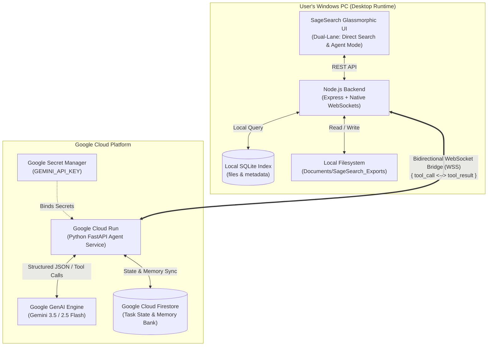

# SageSearch-Agent — Google AI Competition Submission

> **Category**: Taskmaster  
> **Autonomous Multi-Step File Workflow Agent powered by Google Gemini**  
> **Project URL**: [GitHub Repository](https://github.com/gitnyaDanil/SageSearch)

---

## 1. Executive Summary

Knowledge workers spend over **20% of their working hours searching for files and manually transcribing data** from receipts, invoices, and project specs. Most tools simply return a list of files and leave the heavy lifting to the user.

**SageSearch-Agent** transforms file management into an autonomous workflow. By bridging **Google Gemini reasoning** in Google Cloud Run with the user's local filesystem over a secure, privacy-preserving **WebSocket Bridge**, SageSearch-Agent searches local documents, reads unstructured text, extracts structured schema fields, presents interactive preview tables for human approval, and generates production-ready artifacts (like expense report CSVs) directly on the user's device.

---

## 2. System Architecture



---

## 3. Google AI & Cloud Technologies Used

| Service | Role in SageSearch-Agent |
| :--- | :--- |
| **Gemini 3.5 / 2.5 Flash** | Multi-step task planning, document reasoning, and structured JSON extraction. |
| **Google GenAI SDK (`google-genai`)** | Modern Python client utilizing function calling schemas and JSON mode. |
| **Google Cloud Run** | Scalable, containerized serverless hosting for the Python agent service. |
| **Google Cloud Firestore** | Real-time task lifecycle tracking (`tasks/{taskId}`) and user memory store (`memory/{userId}`). |
| **Google Secret Manager** | Secure automated credential injection during deployment. |

---

## 4. The 3 Demo Moments (Taskmaster Scenario)

### Goal:
> *"Find all gym and travel receipts from last month, extract the amounts, and create an expense report CSV"*

### Moment 1: Direct Search (Instant Local Discovery)
- User searches in plain English: *"Show me receipts from last month"*.
- Local SQLite database returns matched PDF/receipt files instantly without files leaving the PC.

### Moment 2: Autonomous Agent Delegation (Multi-Step Execution)
- User switches to **Agent Mode** and clicks the **"Receipts to Expense Report"** workflow.
- Cloud Run Agent creates a multi-step plan:
  1. `search_files` via WebSocket -> locates receipts in `Documents/SageSearch_Demo_Receipts`.
  2. `read_file_content` via WebSocket -> reads unstructured text from each candidate.
  3. `extract_fields` via Gemini -> extracts Merchant, Transaction Date, Amount, and Category.
  4. Real-time step progress is streamed live to the desktop timeline.

### Moment 3: Interactive Review & Artifact Creation
- Agent compiles an itemized preview table totaling **$915.70** (Gym: $81.00, Flight: $423.50, Hotel: $343.00, Uber: $68.20).
- User reviews the table and clicks **`[ Approve & Generate CSV ]`**.
- Local bridge executes `create_artifact` and saves `expense_report_july_2026.csv` in `Documents/SageSearch_Exports`.
- UI provides a 1-click button to open the file directly in Windows Explorer.

---

## 5. Privacy-First Guarantee

- **Files Stay Local**: Document content is parsed locally on the machine. Only search keywords and document text snippets are processed by Gemini function calls.
- **Zero Raw File Uploads**: Raw files are never stored in third-party cloud object storage.

---

## 6. Quick Start & Demonstration

### Prerequisites
- Node.js 22.5+ & Python 3.11+

### 1. Generate Demo Receipts
```bash
python demo_setup.py
```

### 2. Start SageSearch
Double-click **`Start SageSearch.bat`** or run:
```bash
# Terminal 1 (Agent Service)
cd agent-service
python -m uvicorn api.server:app --port 8080

# Terminal 2 (Desktop Backend)
cd backend
npm start
```
Open **`http://localhost:3001`** in your browser.

### 3. Deploy to Google Cloud Run
```powershell
$env:GEMINI_API_KEY = "AIzaSy..."
cd agent-service
.\deploy.ps1 -Project "your-gcp-project-id" -Region "us-west4"
```
